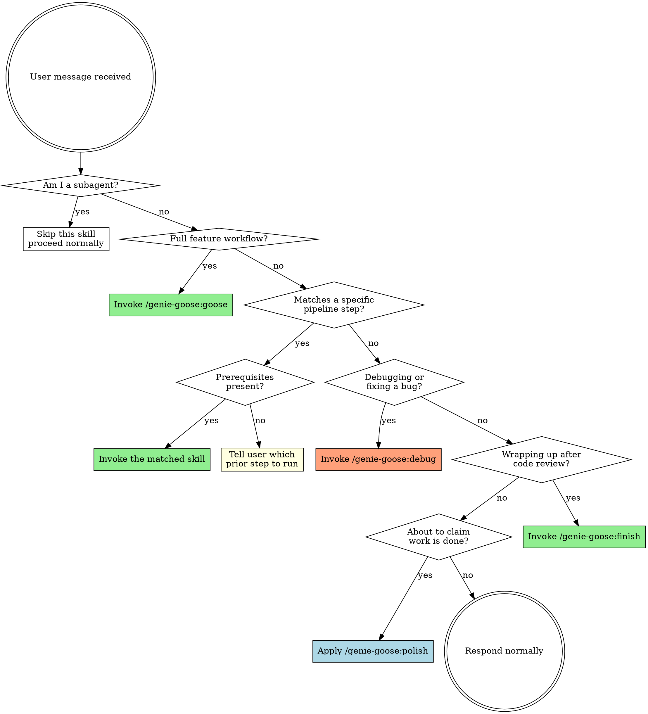

# Lamp

Dynamic skill router for genie-goose. This skill is auto-injected at session start.

<SUBAGENT-STOP>
If you were dispatched as a subagent to execute a specific task, skip this skill entirely.
</SUBAGENT-STOP>

<EXTREMELY-IMPORTANT>
If the user's request matches ANY genie-goose skill, you MUST invoke it using the Skill tool.
This is not optional. Check the routing table below before every response.

IF A SKILL APPLIES TO YOUR TASK, YOU DO NOT HAVE A CHOICE. YOU MUST USE IT.
</EXTREMELY-IMPORTANT>

## Instruction Priority

1. **User's explicit instructions** (project CLAUDE.md, AGENTS.md, direct requests) — highest priority
2. **Genie-goose skills** — override default system behavior where they conflict
3. **Default system prompt** — lowest priority

If the project's CLAUDE.md says "don't use TDD" and a skill says "always TDD," follow the user's instructions.

## How to Access Skills

Use the `Skill` tool to invoke skills by name:

```
Skill("genie-goose:rub")
Skill("genie-goose:architecture")
Skill("genie-goose:implement")
...
```

When you invoke a skill, its content is loaded and presented to you — follow it directly.

## The Routing Rule

**Check the routing table BEFORE every response.** If any skill matches the user's intent, invoke it before doing anything else — even before asking clarifying questions.

## Routing Table

| User Intent | Skill | Notes |
|-------------|-------|-------|
| Build a new feature end-to-end, full workflow | `/genie-goose:goose` | Full 9-step pipeline |
| "Let's brainstorm", "I have an idea", explore approaches | `/genie-goose:rub` | Step 1 entry point |
| Design architecture, structure, components | `/genie-goose:architecture` | Needs design.md |
| Document design intent, check convention conflicts | `/genie-goose:intent` | Needs design.md + architecture.md |
| Write implementation plan, break into tasks | `/genie-goose:write-plan` | Needs architecture.md + intent.md |
| Set up evaluation criteria, review standards | `/genie-goose:criteria` | Needs intent.md + conventions.yaml |
| Execute the plan, start implementing | `/genie-goose:implement` | Needs plan.md + intent.md |
| Code review, review changes | `/genie-goose:honk` | Needs criteria.md + intent.md + diff |
| Create PR, generate PR body, prepare for merge | `/genie-goose:pr` | Needs review-report.md + intent.md + diff |
| Finish up, done, merge after review, wrap up, clean up | `/genie-goose:finish` | Needs review-report.md |
| Update conventions, manage decisions, update ADR | `/genie-goose:update-docs` | Standalone — no pipeline prerequisites |
| Verify completion, prove it works | `/genie-goose:polish` | Any time |
| Fix a bug, debug, investigate error, something broken/failing | `/genie-goose:debug` | Standalone — no prerequisites |
| Quick one-line edit, ad-hoc non-bug task | No skill needed | Apply polish before claiming done |

## Routing Flowchart



## Prerequisite Table

Before invoking a skill, check that its prerequisite artifacts exist in `.goose-artifacts/{branch}/`:

| Skill | Required Artifacts |
|-------|--------------------|
| `rub` | — (none) |
| `architecture` | `design.md` |
| `intent` | `design.md`, `architecture.md` |
| `write-plan` | `architecture.md`, `intent.md` |
| `criteria` | `intent.md` + `.goose/conventions.yaml` |
| `implement` | `plan.md`, `intent.md` |
| `honk` | `criteria.md`, `intent.md` + git diff |
| `pr` | `review-report.md`, `intent.md` + git diff |
| `update-docs` | `.goose/conventions.yaml` or `.goose/decisions.yaml` (at least one must exist) |
| `polish` | — (none) |
| `finish` | `review-report.md` |
| `debug` | — (none) |

If a prerequisite is missing, inform the user which prior step to run. Example:
> `architecture.md` not found. Run `/genie-goose:architecture` first (or `/genie-goose:goose` for the full pipeline).

## Pipeline Resumption

Users who already have some artifacts should be able to jump in at any step. Determine the pipeline position by checking which artifacts exist:

1. Check `.goose-artifacts/{branch}/` for existing artifacts
2. Identify the latest completed step based on artifacts present
3. Suggest the next logical step

Example: If design.md and architecture.md exist but intent.md does not, suggest `/genie-goose:intent` as the next step.

## Non-Pipeline Requests

Not every request needs a genie-goose skill. These can proceed normally:

- Quick bug fixes (one-file, obvious cause)
- Simple refactoring
- Questions about the codebase
- Exploratory tasks
- Configuration changes

**Note:** `/genie-goose:update-docs` is a standalone skill, not a pipeline step. Route to it when the user wants to manage conventions or decisions directly, regardless of pipeline state.

**However:** Even for non-pipeline work, apply `/genie-goose:polish` before claiming the work is done. Evidence before claims, always.

## Red Flags — STOP

These thoughts mean you are rationalizing skipping the router:

| Thought | Reality |
|---------|---------|
| "This is just a quick fix, no skill needed" | Check the routing table first |
| "I already know what to do" | Skills provide structure, not just knowledge |
| "The user didn't mention a specific step" | Infer the step from their intent |
| "I'll just edit the code directly" | Check if implement should be driving this |
| "This doesn't fit any pipeline step" | It might. Check the table. |
| "I'll use the skill next time" | Use it now. No exceptions. |
