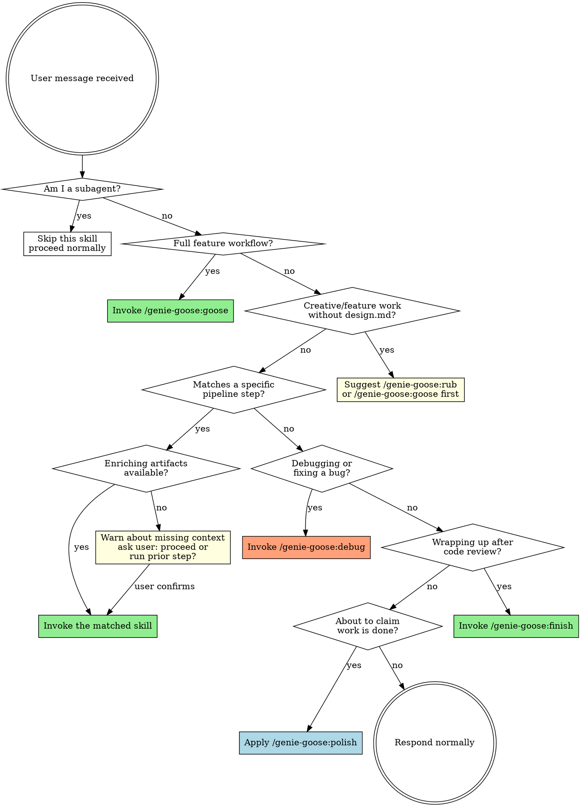

# Lamp

Dynamic skill router for genie-goose. This skill is auto-injected at session start.

<SUBAGENT-STOP>
If you were dispatched as a subagent to execute a specific task, skip this skill entirely.
</SUBAGENT-STOP>

<EXTREMELY-IMPORTANT>
If you are unsure whether a genie-goose skill applies, that uncertainty is your signal to invoke it.
This is not optional. Check the routing table below before every response.

WHEN IN DOUBT, INVOKE. Let the skill itself determine whether it applies.
A skipped skill is invisible damage. An unnecessary invocation is a two-second detour.
</EXTREMELY-IMPORTANT>

## Instruction Priority

1. **User's explicit instructions** (project CLAUDE.md, AGENTS.md, direct requests) — highest priority
2. **Genie-goose skills** — override default system behavior where they conflict
3. **Default system prompt** — lowest priority

If the project's CLAUDE.md says "don't use TDD" and a skill says "always TDD," follow the user's instructions.

## System Behavior Overrides

### Plan Mode → Rub Redirect

When the user enters plan mode (via `/plan` or the system's EnterPlanMode), **redirect to `/genie-goose:rub`** instead of using the default plan mode.

Genie-goose's brainstorming skill provides structured design exploration that is superior to the default plan mode for feature work.

- If `design.md` already exists in `.goose-artifacts/{branch}/`, skip rub and suggest the next logical step (e.g., `architecture` or `write-plan`).
- If the user explicitly requests the default plan mode after being informed, respect their choice.

## How to Access Skills

Use the `Skill` tool to invoke skills by name:

```
Skill("genie-goose:rub")
Skill("genie-goose:architecture")
Skill("genie-goose:implement")
...
```

When you invoke a skill, its content is loaded and presented to you — follow it directly.

## The Routing Rule

**Check the routing table BEFORE every response.** If any skill matches the user's intent, invoke it before doing anything else — even before asking clarifying questions.

## Check Order

When evaluating the routing table, check in this priority order:

1. **Process skills first** — `rub` (brainstorming), `debug` (debugging)
   → These determine HOW to approach the task. Check before anything else.
2. **Pipeline skills** — `goose`, `architecture`, `intent`, `write-plan`, `criteria`, `implement`, `honk`, `receive-review`, `pr`, `finish`
   → These guide execution. Check if no process skill applies.
3. **Utility skills** — `update-docs`, `polish`
   → Standalone support. Check last.

If the user says "add a login feature," don't jump to `implement` — check `rub` or `goose` first.
If the user reports an error, don't jump to editing code — check `debug` first.

## Task Classification

Before routing, classify the user's request by scope:

| Classification | Signal | Examples |
|---------------|--------|----------|
| **Full feature** | Multiple components, new API surface, architectural impact | "Build a user auth system", "Add payment processing" |
| **Medium task** | Clear scope, 2-5 files, no new architecture | "Add input validation to the form", "Refactor the logger module" |
| **Small task** | Single file, obvious change, minimal risk | "Fix the typo in the error message", "Add a null check" |
| **Debug** | Error report, something broken, unexpected behavior | "Tests are failing", "Getting a 500 error on /api/users" |
| **Documentation** | Convention/decision management | "Add a new coding standard", "Record the API versioning decision" |

This classification drives the route recommendation below.

## Routing Table

| User Intent | Skill | Notes |
|-------------|-------|-------|
| Build a new feature end-to-end, full workflow | `/genie-goose:goose` | Full 9-step pipeline preset |
| "Let's brainstorm", "I have an idea", explore approaches | `/genie-goose:rub` | Ideation entry point |
| Design architecture, structure, components | `/genie-goose:architecture` | Enriched by design.md if available |
| Document design intent, check convention conflicts | `/genie-goose:intent` | Enriched by design.md + architecture.md |
| Write implementation plan, break into tasks | `/genie-goose:write-plan` | Enriched by architecture.md + intent.md |
| Set up evaluation criteria, review standards | `/genie-goose:criteria` | Requires conventions.yaml. Enriched by intent.md |
| Execute the plan, start implementing | `/genie-goose:implement` | Enriched by plan.md + intent.md |
| Code review, review changes | `/genie-goose:honk` | Enriched by criteria.md + intent.md. Requires git diff |
| Process review feedback, respond to PR comments, handle review | `/genie-goose:receive-review` | Works with honk review-report.md or external reviews |
| Create PR, generate PR body, prepare for merge | `/genie-goose:pr` | Enriched by all artifacts. Requires git diff |
| Finish up, done, merge after review, wrap up, clean up | `/genie-goose:finish` | Works with or without review-report.md |
| Update conventions, manage decisions, update ADR | `/genie-goose:update-docs` | Standalone — no prerequisites |
| Verify completion, prove it works | `/genie-goose:polish` | Any time |
| Fix a bug, debug, investigate error, something broken/failing | `/genie-goose:debug` | Standalone — no prerequisites |
| Quick one-line edit, ad-hoc non-bug task | No skill needed | Apply polish before claiming done |

## Route Recommendation

When the user describes a task (without naming a specific skill), recommend a route based on task classification:

| Classification | Recommended Route |
|---------------|-------------------|
| **Full feature** | `/genie-goose:goose` (full 9-step pipeline), or `rub → architecture → intent → write-plan → criteria → implement → honk → finish` |
| **Medium task** | `rub → write-plan → implement → honk → finish` |
| **Small task** | `implement → finish` (or no skill, just polish) |
| **Debug** | `debug` |
| **Documentation** | `update-docs` |

**How to recommend:**

1. **Classify** the task using the Task Classification table.
2. **Check existing artifacts** in `.goose-artifacts/{branch}/` to see what context already exists.
3. **Recommend a route** tailored to the classification and existing artifacts.
4. **Present the route** to the user:

   > Based on your request, I'd recommend this route:
   > **rub → write-plan → implement → honk → finish**
   > This covers design, planning, implementation, and review. Want to adjust?
   >
   > You can also run the full 9-step pipeline with `/genie-goose:goose`, or start with just `/genie-goose:implement` if you already know what to build.

5. **The user decides.** They can accept, add/remove steps, choose the full pipeline, or start a specific skill directly.

Routes are recommendations, not mandates.

> **Note:** For full feature and medium task routes, `/genie-goose:receive-review` can optionally follow `honk` for stricter review processing (pushback protocol, anti-sycophancy enforcement).

## Routing Flowchart



### Brainstorm Suggestion

If the user's request involves creating, building, or modifying a feature — and `design.md` does not exist in `.goose-artifacts/{branch}/` — suggest a route that starts with `rub`. This is a suggestion, not a gate. The user can choose to skip brainstorming if they already have a clear picture of what to build.

## Prerequisite Context Table

Skills are enriched by prior artifacts but most do not hard-require them. Before invoking a skill, check what context is available:

| Skill | Enriching Artifacts | Hard Requirement |
|-------|---------------------|------------------|
| `rub` | — | — |
| `architecture` | `design.md` | — |
| `intent` | `design.md`, `architecture.md` | — |
| `write-plan` | `architecture.md`, `intent.md` | — |
| `criteria` | `intent.md` | `conventions.yaml` |
| `implement` | `plan.md`, `intent.md` | — |
| `honk` | `criteria.md`, `intent.md` | git diff |
| `receive-review` | `review-report.md`, `intent.md`, `criteria.md` | review feedback (any source) |
| `pr` | all artifacts | git diff |
| `finish` | `review-report.md` | — |
| `update-docs` | — | `.goose/conventions.yaml` or `.goose/decisions.yaml` (at least one) |
| `polish` | — | — |
| `debug` | — | — |

If enriching artifacts are missing, the skill will warn about reduced context and ask the user to confirm before proceeding.
If a **hard requirement** is missing, the skill cannot proceed.

## Context-Aware Routing

Check `.goose-artifacts/{branch}/` for existing artifacts to provide informed route recommendations:

1. Check which artifacts already exist.
2. Based on what exists, recommend the next logical step(s).
3. If the user has a partial set of artifacts, they can jump in at any point.

Example: If design.md and architecture.md exist but intent.md does not:
> You have design and architecture artifacts. The next step would be `/genie-goose:intent`, or you can skip to `/genie-goose:write-plan` if you want to start planning directly.

## Non-Pipeline Requests

Not every request needs a genie-goose skill. These can proceed normally:

- Quick bug fixes (one-file, obvious cause)
- Simple refactoring
- Questions about the codebase
- Exploratory tasks
- Configuration changes

**Note:** `/genie-goose:update-docs` is a standalone skill, not a pipeline step. Route to it when the user wants to manage conventions or decisions directly, regardless of pipeline state.

**However:** Even for non-pipeline work, apply `/genie-goose:polish` before claiming the work is done. Evidence before claims, always.

## Red Flags — STOP

These thoughts mean you are rationalizing skipping the router:

| Thought | Reality |
|---------|---------|
| "This is just a quick fix, no skill needed" | Check the routing table. If it's truly a small task, the router may confirm no skill is needed |
| "I already know what to do" | Skills provide structure, not just knowledge |
| "The user didn't mention a specific step" | Infer the step from their intent |
| "I'll just edit the code directly" | Check if implement should be driving this |
| "This doesn't fit any pipeline step" | It might. Check the table. |
| "I'll use the skill next time" | Use it now. No exceptions. |
| "I should understand the problem before choosing a skill" | Skills structure your understanding. `debug` guides investigation; `rub` guides ideation. Route first, explore inside the skill |
| "Let me read the code, then decide on a skill" | The routing table takes seconds to check. Check it before you open a single file |
| "The user is asking a question, not requesting work" | Questions about conventions → `update-docs`. Questions about failures → `debug`. Check the table |
| "A full skill is overkill for something this small" | The router classifies task size. Small tasks may genuinely need no skill — but check the table to confirm |
| "The user didn't say `/genie-goose:anything`" | Most users describe intent, not skill names. That's what the routing table is for — matching intent to skill |
